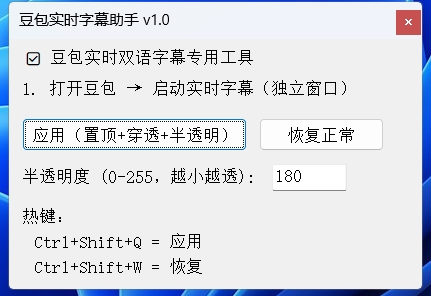
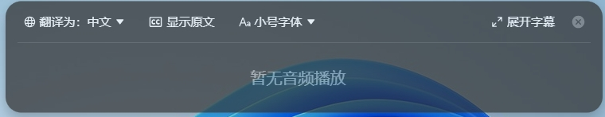

# 豆包实时字幕助手 v1.0

[](https://www.gnu.org/licenses/gpl-3.0)
[](#)
[](https://www.autohotkey.com/)

一个专为 **豆包（Doubao）** 实时双语字幕设计的轻量级辅助工具。它能让豆包字幕窗口**置顶显示、鼠标穿透、整体半透明**，方便你在观看外语视频、会议或学习时，既能看清字幕，又不遮挡背后的内容。

 **AutoHotkey v2.0是一个脚本软件，不推荐与带反作弊游戏（如：ACE,EAC）同时使用** 

---

## ✨ 核心功能

- **窗口置顶**  
  字幕窗口始终保持在最前，不会被其他应用遮挡。

- **鼠标穿透**  
  鼠标可以直接点击穿透字幕区域，操作背后的窗口（如视频播放器、笔记软件），无需频繁移动字幕窗口。

- **整体半透明**  
  字幕背景与文字整体半透明（透明度可调），既看清字幕又不完全遮挡后方内容。

- **热键支持**  
  `Ctrl+Shift+Q` 一键应用效果，`Ctrl+Shift+W` 一键恢复正常。

- **精准识别**  
  只针对豆包**独立显示的实时字幕窗口**生效，不会误操作豆包主窗口。

- **绿色便携**  
  单个 `.exe` 文件，无需安装，即开即用。

---

## 📸 效果预览




---

## 🚀 快速开始

### 1. 下载

前往 [Releases](https://github.com/mhlms/DOUBAO_RTT/releases) 页面，下载最新的 `豆包字幕助手_v1.0.exe`。

### 2. 使用步骤

1. **打开豆包客户端**，启动“实时双语字幕”功能，并确保**字幕窗口独立显示**（而非嵌入在主窗口内）。
2. **双击运行** `doubaoRTTV1.0.exe`，系统托盘会出现图标。
3. 在软件主界面或通过托盘菜单，点击 **“应用”** 或按 `Ctrl+Shift+Q`。
4. 如需调整透明度，可在界面输入框中修改数值（0-255，越小越透），然后再次点击“应用”。
5. 点击 **“恢复正常”** 或按 `Ctrl+Shift+W` 即可撤销效果。

---

## ⚙️ 技术说明

### 为什么不能只透明背景、保留文字不透明？

豆包实时字幕窗口基于 **Chromium 内核**，启用了**硬件加速渲染**。其内容由 GPU 直接绘制，绕过了 Windows 传统的 GDI 颜色键控机制。因此，AutoHotkey 的 `WinSetTransColor`（颜色穿透）功能在该类窗口上**无效**，强行使用会导致黑边框或样式异常。

本工具采用 **整体半透明**（`WinSetTransparent`）方案，兼顾稳定性和实用性，是目前 AutoHotkey 框架下最可靠的实现方式。

### 兼容性

- 支持 Windows 10 / 11（32位和64位系统）。
- 提供 32位可执行文件，确保最大兼容性。
- 需要豆包客户端版本较新（建议保持更新）。

---

## 🧑‍💻 自行编译

如果你希望从源码运行或修改：

1. 安装 [AutoHotkey v2.0](https://www.autohotkey.com/)。
2. 克隆本仓库。
3. 使用 Ahk2Exe（随 AHK 安装）编译 `豆包字幕助手.ahk`，推荐 Base File 选择 `AutoHotkey32.exe`。
4. （可选）使用 Resource Hacker 替换程序图标。


---

## 📁 项目结构

```

.
├── doubaoV1.0.ahk          # 主脚本源码
├── doubaoRTTV1.0.exe     # 编译好的可执行文件
├── shell32_dll_Icon_23.ico          # 程序图标
└── README.md

```

---

## ❓ 常见问题

### Q: 点击“应用”后提示“未找到豆包实时字幕窗口”？
A: 请确保豆包的实时字幕功能已开启，且**字幕窗口是独立浮动窗口**（可拖出豆包主界面），而非嵌入在主界面内。

### Q: 为什么我的字幕窗口只变淡了，背景没有完全消失？
A: 这是正常现象。由于豆包窗口的硬件加速限制，本工具采用“整体半透明”而非“颜色穿透”。背景不会完全透明，但会变淡且不遮挡点击。

### Q: 托盘菜单中的“一键应用”和“恢复正常”点击后报错？
A: 最新版本已修复该问题。如果你使用的是旧版，请更新到 v1.0 或更高版本。

### Q: 杀毒软件报毒怎么办？
A: 这是 AutoHotkey 编译程序常见的误报。本工具开源，代码透明，请放心使用。如不放心，可自行从源码编译。

---

## 🤝 贡献与反馈

欢迎提交 [Issue](https://github.com/mhlms/DOUBAO_RTT/issues) 反馈使用中的问题或建议。

如果你有更好的实现方案（例如通过 OCR 或 API 实现完美背景透明），欢迎 PR 或交流讨论。

---

## 📄 许可证

本项目采用 [GNU General Public License v3.0](LICENSE) 协议。你可以自由使用、修改和分发，但衍生作品也必须以相同协议开源。

---

## ⭐ 支持项目

如果这个工具帮到了你，欢迎给个 **Star** ⭐，让更多人发现它！

---
*Made with ❤️ and AutoHotkey*
